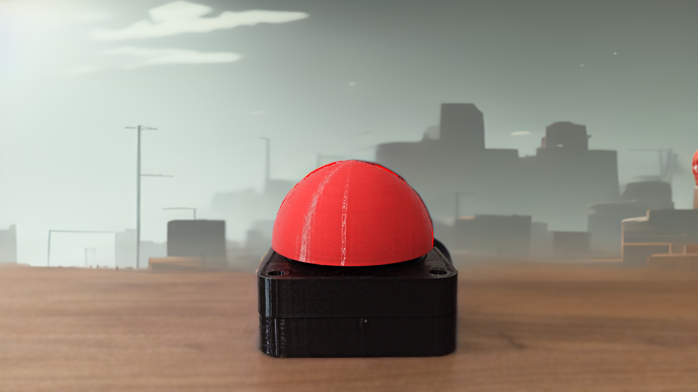

# Arduino İle Mario!

## Arduino İle Mario!
3D yazıcı ile yaptığım bu mega buton ile projelerimize eğlence katıyoruz. 🌟

Proje hakkında daha fazla bilgi almak için aşağıdaki videoyu izleyebilirsiniz:
[YOUTUBE VİDEOSU: Devasa Buton](https://www.youtube.com/watch?v=1FV1k7at37U)

### 3D Baskı Dosyaları
Projenin 3D baskı dosyalarına [buradan ulaşabilirsiniz](https://www.thingiverse.com/thing:1406545).

## Malzeme Listesi

- [Mekanik Klavye Switch]
- [Jumper Kablo]
- [Filament]
